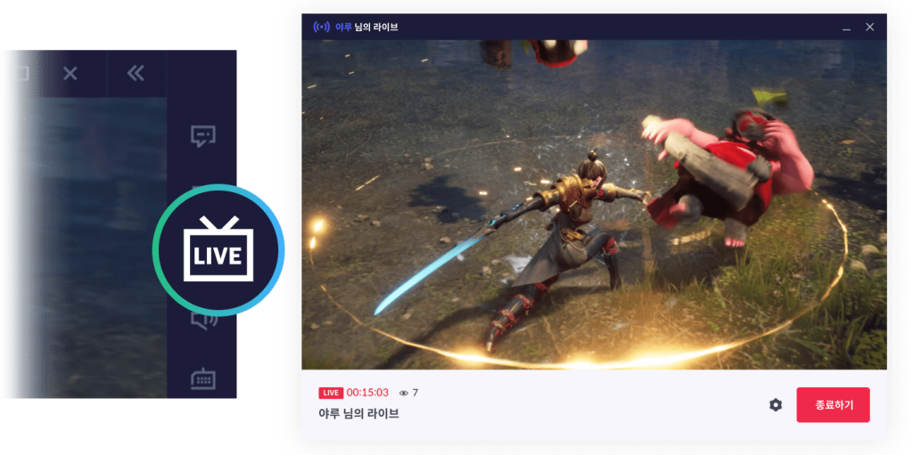

# Purple Live
<p align="center" width=128>
    
</p>

<br></br>

<p></p>
퍼플라이브는 PC에서 Purple 게임의 Audio/Video 스트리밍을 위한 어플리케이션입니다.
<p></p>퍼플라이브는 64bit Windows만을 지원합니다.
<br></br>

## 준비사항

퍼플라이브를 빌드하기위해서 준비해야하는 것은 다음과 같습니다.
```
Visual Studio 2017
QT 5.13.1
```
<br></br>

## Features

### 게임화면 공유 - 퍼플의 게임화면을 캡쳐하여 공유합니다.

### 비디오 인코딩 지원

  * NVIDIA NVENC Encoding - NVIDIA Video Codec SDK 설치 필요
  * AMD AMF Encoding
  * INTEL QSV Encoding
  * SOFTWARE Encoding

### 마이크 지원
<br></br>

## 구성
### purple-live - 퍼플라이브 Application
### nc-media-sdk - 미디어전송(WebRTC)과 인코딩 라이브러리
### nc-capture-sdk - 게임화면 캡쳐 라이브러리
<br></br>

## 빌드 방법
### nc-media-sdk
  * nc-media-sdk는 CLCWebsocketClient와 CommunityLiveCore로 구성되며, nc-media-sdk-win-without-nvenc.sln을 통해 빌드합니다.
  * NVENC 가속을 지원하기 위해서는 NVIDIA Video Codec SDK(8.2)가 필요합니다.<p></p>
  [NVIDIA Video Codec SDK](https://developer.nvidia.com/nvidia-video-codec-sdk)를 다운로드 받아 NvEncoder의 코드를 CommunityLiveCore\src\nvcodec\NvEncoder 폴더에 복사한후 nc-media-sdk-win.sln을 통해 빌드합니다.
  * 빌드후 필요한 파일을 복사합니다.
  <br>nc-media-sdk\copy_lib.bat 실행<br>
### nc-capture-sdk
  * NCCaptureSDK.sln을 통해 빌드합니다.
  * 빌드후 필요한 파일을 복사합니다.
  <br>nc-capture-sdk\copy_lib.bat 실행<br>
### purple-live
  * VideoChat.sln을 통해 빌드합니다.
<br></br>
